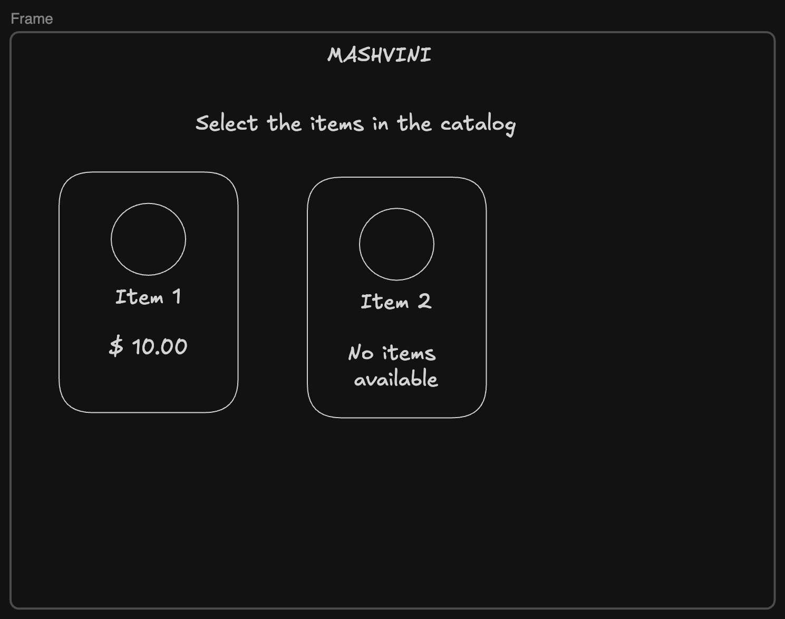

# Build Catalog

We must add a catalog for our app to allow clients to visualize the items in the catalog.
For each item in the catalog, we must show the item image, the name, and the price. If there is no stock, we must show "Not available in stock" and hide the price.

We must load a limited set of items, load more as we scroll the page.

I will generate a plan from this task description with Claude, make the necessary adjustments and then implement using the root session as cordinator and parallel sub-agents for backend and frontend since they don't rely properly on each other.

## Frontend

- Create components based on shadcn/ui following [frontend decision](../decisions/01-frontend.md).
- Components:
  - Card with image, name and price
  - Badge for sold out.
    - We will reuse this badge for showing partial stock in the order-building screen (stock of 1, but user wants 2). That usage is out of scope for this task; only sold-out state is needed here.
  - Skeleton for loading state (initial load only). Scroll-triggered pagination fetches use a smaller inline loading indicator at the bottom of the list instead of the full skeleton.
  - Sonner for status toasts in general. Implement error for catalog retrieval error.
- Fetch items with TanStack Query's `useInfiniteQuery`, keyed by page/size, per
  [frontend decision](../decisions/01-frontend.md).
- The main target device for the app is a Tablet/iPad, so we should render few items per row in a responsive way.
- Accessibility: add aria labels and alt text for the item image. Toasts already announce via Sonner's built-in `aria-live` region, no extra work needed there.
- Implement status toast globally in the app
  - Render error if the catalog request fails
- Add a `/catalog` route and set it as the default (`/`) route on the existing router in `App.tsx` (already set up for `/health`).

Here is a wireframe for the catalog:



- Final structure
- src/
  - catalog/
    - catalog-item/
      - CatalogCard.tsx
      - CatalogCard.test.tsx
      - StockBadge.tsx
      - StockBadge.test.tsx
    - catalogItem.ts
    - Catalog.tsx
    - Catalog.test.tsx
    - CatalogSkeleton.tsx
    - CatalogSkeleton.test.tsx
    - useCatalogItems.ts
    - useInView.ts
  - config/
    - queryClient.ts
    - queryClient.test.ts
  - test/
    - renderWithClient.tsx
    - setup.ts
  - ui/
    - badge.tsx
    - card.tsx
    - skeleton.tsx
    - sonner.tsx
    - utils.ts


### Test cases

- Catalog loaded
  - stock
    - check if item in stock was rendered correctly
    - check if item out of stock rendered the message
  - check loading state with skeleton
  - pagination
    - check new request on scroll and rendering
    - check no requests on scroll when current page is the last
- Error to get catalog
  - Show alert with error

## Backend

- Entities:
  - Item (single table, no catalog entity since we only ever have one catalog)
    - id: int # PK
    - name: str
    - price: float
    - stock: int, sold out when `stock <= 0`
    - image_url: str
    - created_at: datetime # default now()
  - Use SQLAlchemy's mapping so the entity stays a dataclass per backend decision while still being an ORM-mapped class.
- Image storage: images are stored in the `medias/` folder of the repo that will be public. Since we won't have a CRUD, there won't be any endpoint for managing medias and we will store just the media url in the database.
  - `image_url` is the full public GitHub raw URL.
- Define only `Out` schemas for items, since it won't have create/update/delete for them.
  - Configure ConfigDict for loading the ORM model (Add this as a rule for the Claude backend rule)
- Inject Item repository as dependency in the route
- Add `/items` endpoint:
  - Receive `page` (0-indexed) and `size` query parameters
  - Order results by `id` ascending, so pagination is deterministic
  - On failure, return a standard error response (status code + `{"detail": str}` body) that the frontend's error toast can key off of
  - Add logging messages for getting items and found x items using logging library
  - Return the following
    ```json
    {
        page: int,
        size: int,
        total: int,
        data: [
            {
                id: int,
                name: str,
                price: float,
                stock: int,
                image_url: str
            }
        ]
    }
    ```
  - Add an Alembic migration for the item entity
  - Add seed data for the following items:
    ```csv
    name,price,stock,image_url
    Voss water,9.00,12,https://raw.githubusercontent.com/viniciusvmda/mashvini/main/medias/01-voss-water.png
    Guaraná Antártica,1.00,0,https://raw.githubusercontent.com/viniciusvmda/mashvini/main/medias/02-guarana-antartica.png
    Xeque Mate,1.50,8,https://raw.githubusercontent.com/viniciusvmda/mashvini/main/medias/03-xeque-mate.png
    Mentos,0.20,20,https://raw.githubusercontent.com/viniciusvmda/mashvini/main/medias/04-mentos.png
    Halls,0.10,0,https://raw.githubusercontent.com/viniciusvmda/mashvini/main/medias/05-halls.png
    Trident,0.15,15,https://raw.githubusercontent.com/viniciusvmda/mashvini/main/medias/06-trident.png
    Oreo,1.00,6,https://raw.githubusercontent.com/viniciusvmda/mashvini/main/medias/07-oreo.png
    Aritana Popcorn,0.90,0,https://raw.githubusercontent.com/viniciusvmda/mashvini/main/medias/08-aritana-popcorn.png
    Doritos,1.50,10,https://raw.githubusercontent.com/viniciusvmda/mashvini/main/medias/09-doritos.png
    Pringles,2.00,5,https://raw.githubusercontent.com/viniciusvmda/mashvini/main/medias/10-pringles.png
    Ruffles,1.30,9,https://raw.githubusercontent.com/viniciusvmda/mashvini/main/medias/11-ruffles.png
    ```

### Test cases

Mock database and test REST client

- Empty items table -> output with page, size and total = 0, empty data
- 3 items in the database, page 0 and size 2 only return first 2 items (ordered by id)
- 3 items in the database, page 1 and size 2 only return last item
- 3 items in the database, page 2 and size 2 return data empty
- Item with stock 0 is still returned by the endpoint with `stock: 0` (hiding the price is a frontend concern)

## Changes from the original design

- `shadcn/ui` is copied into a folder in the frontend. I decided to copy it to `src/ui` instead of the original path `src/components/ui`. I also had to exempt the naming convention for this folder that use kebab-case names.
- `shadcn/ui` toasts are triggered by functions, so I discarded the original plan that would build status toast components (success, error, warning) and implement global status logic. The function brings this out of the box.
- Add more items to the database to showcase infinite scroll.
- Fixed issue with infinite scroll that was loading all the pages when loading the next page. Fixed adding a callback to reset `inView` state before fetching next page.