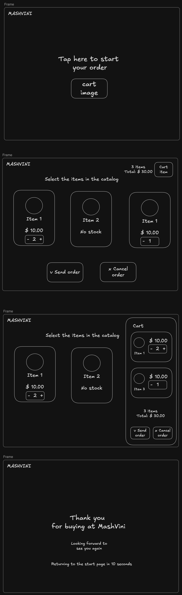

# Build Order

We must let clients build an order from the catalog: pick items, adjust quantities, review the cart, and finalize the order. The cart is a side panel rather than a full-size screen, per [order decision](../decisions/06-order.md).

I will generate a plan from this task description with Claude, make the necessary adjustments and then implement using the root session as coordinator and parallel sub-agents for backend and frontend since they don't rely properly on each other.

Here is a wireframe for the flow for reference:



## Frontend

- Reuse shadcn/ui components throughout and the components already copied into `src/ui` for the catalog adding to that same folder instead of introducing a second component source.
- Idle screen ("Tap here to start your order") as the entry point. Tapping it clears any previous cart state and takes the client to the catalog.
- Cart state (selected items and quantities) is managed with `useReducer` (add item, remove item, set quantity, clear actions) and shared between the catalog, `Header`, cart panel, and `Footer` via context. See [order decision](../decisions/06-order.md). It's client-only state that doesn't need to survive a reload, and is never persisted to the backend while it's being built; `POST /orders` is only called on "Finalize order".
- Layout components (new, reused across the catalog and cart screens):
  - `Header`: app name ("MASHVINI") and the cart summary (item count, total). `position: fixed` to the top of the viewport, so it stays visible while the catalog/cart content scrolls under it.
  - `Footer`: "Finalize order" and "Cancel order" actions. `position: fixed` to the bottom of the viewport for the same reason, and rendered only while the cart has at least one item.
    - Cancel opens a confirm dialog (shadcn/ui `AlertDialog`)
      - Confirming clears the cart state and navigates back to the idle screen. This is a frontend-only reset, no backend call, since nothing has been persisted yet.
- Components:
  - Quantity stepper (`- qty +`), reused on both the catalog card (once an item has been added) and the cart line item.
  - Cart side panel listing the selected items (thumbnail, name, price, stepper); item count and total live in the `Header`, actions live in the `Footer`.
  - Success screen, styled like the idle screen, shown after a successful "Finalize order"
    - ("Thank you for buying at MashVini" / "Looking forward to see you again"). Shows a countdown
    - ("Returning to the start page in N seconds") that navigates back to the idle screen at 0, and a "Start new shop" button that navigates back to the idle screen immediately, skipping the countdown.
  - Reuse the sold-out badge from catalog if an item's stock drops to 0 while it's in the cart .
  - Idle-timeout warning dialog (shadcn/ui `AlertDialog`), so an abandoned session on the catalog doesn't block the tablet for the next customer..
- Idle timeout: on the catalog screen (cart empty or not), after 90 seconds with no interaction (tap, mouse move, scroll, stepper change), show the idle-timeout dialog ("Still there?") with a 10 second countdown. Any interaction with the dialog or the page cancels it and resets the 90 second timer.
  - If it reaches 0, clear the cart state and navigate back to the idle screen, same as a confirmed "Cancel order". 
  - Not active on the idle screen itself or the success screen (already has its
  own countdown).
- Call `POST /orders` with a TanStack Query mutation on "Finalize order".
  - On success, clear the cart and navigate to the success screen.
  - On the item-not-available error, show which item(s) are no longer available via toast, update their stock/availability in the cached catalog data, and keep the rest of the cart intact so the client only has to fix the conflicting item. Stay on the cart panel so they can retry.
  - On any other failure (e.g. network/server error), show an error toast and keep the cart intact so the client can retry "Finalize order".
- The main target device is a tablet, so the side panel and catalog grid must share the screen without the panel forcing the catalog into a single column, and content must have enough bottom padding to not be hidden behind the fixed `Footer` when it's showing.
- Accessibility: aria labels for the stepper buttons and the cart panel (e.g. `aria-live` for the
  total, so screen readers announce it as it changes), and for the confirm/idle-timeout dialogs.

### Test cases

- Idle screen navigates to the catalog and starts with an empty cart.
- Adding/removing items updates the stepper, the cart panel, the item count, and the total.
  - If the stock limit is reached, we block the increase step
  - If the quantity reaches 0, we remove the item from the cart
- `Header` stays visible (fixed) when the catalog/cart content is scrolled.
- `Footer` is hidden with an empty cart, appears once an item is added, and stays visible (fixed)
  when the catalog/cart content is scrolled.
- Cancel order
  - Opens a confirm dialog; dismissing it keeps the cart untouched.
  - Confirming clears the cart and navigates back to the idle screen.
  - Not confirming keeps the cart and state intact and close the dialog
- Idle timeout
  - No interaction for 90 seconds on the catalog screen shows the "Still there?" dialog.
  - Interacting with the page or the dialog before it reaches 0 cancels it and resets the timer.
  - Reaching 0 clears the cart and navigates back to the idle screen.
  - Not triggered on the idle screen or the success screen.
- Finalize order
  - Success: cart clears, success screen shown with a countdown that navigates back to idle at 0.
  - Success screen "Start new shop" button navigates back to idle immediately, without waiting for the countdown.
  - Item no longer available: toast shows the conflicting item(s), that item's stock/availability updates, the rest of the cart is preserved, client stays on the cart panel.
  - Request failure (e.g. network/server error): error toast shown, cart is preserved, client stays on the cart panel.

## Backend

- Entities:
  - Order
    - id: int # PK
    - created_at: datetime # default now()
  - OrderLine
    - id: int # PK
    - order_id: int # FK -> order
    - item_id: int # FK -> item
    - quantity: int
    - price: float # captured from item.price at order time
  - No `status` field yet: every persisted order has already fully succeeded (creation is atomic).
- Add `/orders` endpoint (`POST`):
  - Receive a list of `{item_id, quantity}`.
  - In a single database transaction:
    - Re-read the current stock for every requested item (don't trust client-side stock).
    - If any item doesn't exist or doesn't have enough stock, raise a custom exception and roll back the whole transaction (no partial order, no partial stock decrement).
    - Decrement stock for each item.
    - Insert the order and its order lines, copying `item.price` into `order_line.price`.
  - Custom exceptions, mapped to FastAPI exception handlers so every endpoint returns the same `{"detail": str}` shape:
    - `ItemNotFoundError` -> 404
    - `ItemNotAvailableError` (not enough stock) -> 409, with enough detail (e.g. item name and available stock) for the frontend to point at the conflicting item.
  - Add logging messages for order creation attempts and results (success, and which error on failure).
  - Return the created order:
    ```json
    {
        "id": int,
        "created_at": str,
        "lines": [
            {
                "item_id": int,
                "quantity": int,
                "price": float
            }
        ]
    }
    ```
  - Add an Alembic migration for the order and order_line entities.

### Unit tests

No database mocking here: this tier only covers request-schema validation, which doesn't touch persistence at all, per [order decision](../decisions/06-order.md). Lives in `tests/unit/`.

- Empty line list: 422.
- Line with zero/negative quantity: 422.
- Malformed payload (e.g. missing `item_id`): 422.

### Integration tests

This is the most complex business logic so far, and the cases worth testing are all about real persistence behavior, so they run against a real Postgres
instead of mocks. Lives in `tests/integration/`,
against a disposable Postgres database (dedicated test database on the dev Postgres, reset between tests).
- Add a `make test-integration` target (existing `make test` stays unit-only and DB-free).
- Add a service container with Postgres for this job in `pr_checks.yml`, running `make test-integration` as its own step/job, separate from the existing unit test step.
- Test cases
  - Order created successfully: verify via direct DB query, not just the response, that the order, its order lines, and the decremented stock are all persisted correctly.
  - Verify that no change was persisted (orders and stock) in DB for with direct query:
    - Item does not exist: 404, 
    - Item exists but requested quantity exceeds stock: 409,
    - Order with multiple lines where only one item fails: whole request rolls back
    - Concurrent orders for the last unit of stock: fire two requests for the same item (stock = 1, each requesting 1) at the same time. Exactly one succeeds (stock ends at 0, one order persisted). The other gets the not-available error. Stock never goes negative.
